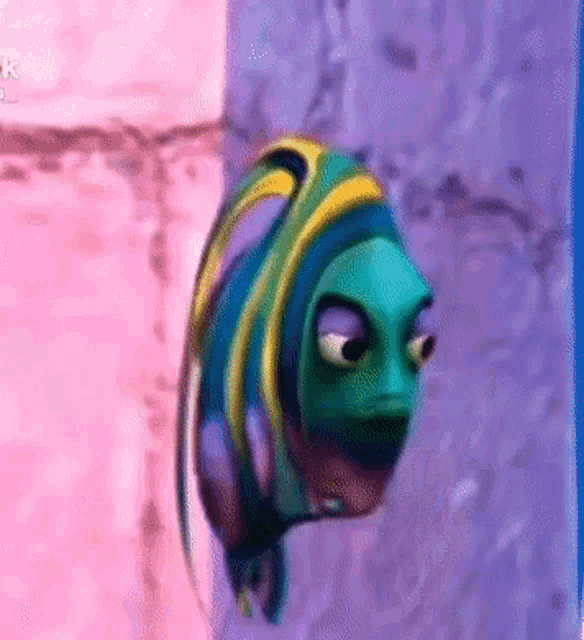

## Olá! Sou Guilherme Ramos 👋

🎓 Estudante de Engenharia de Software na Unicesumar.

💻 Tenho interesse em HTML, CSS e JavaScript, tecnologias que estou estudando para desenvolver minhas habilidades em desenvolvimento web.

🚀 Busco construir uma carreira na área de tecnologia, iniciando pelo Front-End e evoluindo para o desenvolvimento Full Stack, sempre em busca de novos desafios e aprendizado contínuo.

 
  
  
  
  

##

  

  

  

  

##
<picture align="center">
  <source media="(prefers-color-scheme: dark)" srcset="https://raw.githubusercontent.com/GuilhermeRMachado/GuilhermeRMachado/output/github-contribution-grid-snake-dark.svg">
  <source media="(prefers-color-scheme: light)" srcset="https://raw.githubusercontent.com/GuilhermeRMachado/GuilhermeRMachado/output/github-contribution-grid-snake-dark.svg">
  
</picture>
